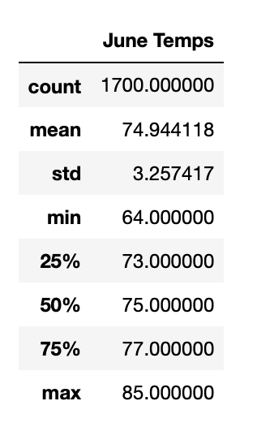

# **Surfs-Up**
*Use Python, SQLAllechemy, and Flask to analyze and visualize climate data*

## Overview of Project:

#### *Purpose:*
Determin if an ice cream shop business in Oahu is sustainable year-round. Gather and analyze weather information from June and December tempature trends to give recomendation. 

# Results 

